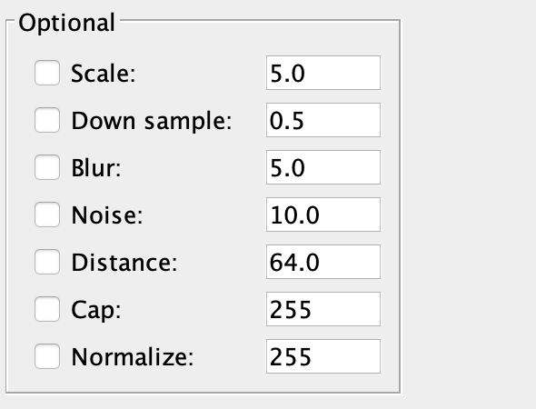

# Synthetic Fiber Generator - SynFiber

Affectionately known as "worm simulator." Written by Matthew Dutson for the Laboratory for Optical and Computational
Instrumentation at the University of Wisconsin-Madison.

## Objective

The [CT-FIRE](https://loci.wisc.edu/software/ctfire) and [CurveAlign](https://loci.wisc.edu/software/curvealign) packages
are used to analyze images of collagen fibers in human tissue. The alignment and orientation of these fibers can be a
prognostic signature for certain cancers. SynFiber allows the user to generate synthetic images of collagen fibers with
known properties. These images can be used to verify the accuracy and test the limitations of the CT-FIRE and CurveAlign
algorithms.

More generally, SynFiber can be used to simulate images of any fibrous structure. It allows for a high level of
customization of the structure and appearance of fibers.

## Installation

SynFiber is distributed as ZIP archive - visit the Releases page of this repository for the most recent version. When
extracted it contains the following:

 * `java_app.jar`: The main JRE executable
 * `defaults.json`: The default parameters file - this can be modified by the user
 * `output/`: The default output location (assuming the working directory is its parent)

The JRE file comes bundled with all required dependencies. Therefore, all that is needed is the Java Runtime Environment
(downloadable [here](https://www.java.com)). With Java correctly installed, SynFiber can be run simply by double-clicking
`java_app.jar` or from the command-line by navigating to the extracted archive and typing `java -jar java_app.jar`

## Downloading the Source

The source is also available on the Releases page. It has two dependencies: Apache Commons Math and Google Gson. The
test suite additionally requires JUnit 5. All three are available from Maven Central.

### Apache Commons Math
```xml
<dependency>
   <groupId>com.google.code.gson</groupId>   
   <artifactId>gson</artifactId>
   <version>2.8.5</version>
</dependency>
```

### Gson
```xml
<dependency>
   <groupId>org.apache.commons</groupId>   
   <artifactId>commons-math3</artifactId>
   <version>3.6.1</version>
</dependency>
```
    
### JUnit 5
```xml
<dependency>
   <groupId>org.junit.jupiter</groupId>   
   <artifactId>junit-jupiter-api</artifactId>
   <version>5.3.1</version>
</dependency>
```

## Basic Operation

On startup, the following window will display:


Provided SynFiber was launched in a valid working directory (one which contains `defaults.json` and `output/`) an image
can be produced with the default parameters by pressing the "Generate" button. A preview of the generated image will be
displayed on the left side of the window.

To generate more than one image, modify the "Number of images" field and press the "Generate" button. The user can cycle
through previews of multiple images by pressing the "Previous" and "Next" buttons.

While parameters can be manually modified through the GUI, it is often more convenient to load a batch of parameters
from a JSON file. This can be accomplished by pressing the "Open" button to the right of the "Parameters" label. Each
time "Generate" is pressed, the current parameters are saved to the file `params.json` in the output directory. These
can then be loaded during future sessions.

By default, image and data files are written to `output/` in the current working directory. To change this location,
press the "Open" button to the right of the "Output Location" label and select the desired directory.

## Description of Options

### Session


Parameters: Used for bulk loading of parameters from a previous session.

Output location: Used to set the output directory for images, data files, and `params.json`.

Number of images: The number of random images to generate.

Seed: Whether to fix the random number seed at the start of execution. If this is unchecked, a different set of images
will be produced each time "Generate" is pressed. If checked, the sequence of random images will depend only on the 
value of the seed.

### Distributions


Length distribution: Fiber length is defined as the distance along the fiber's path in pixels. Each fiber's length
is chosen by randomly sampling from this distribution. A summary of the current distribution can be seen below the
"Length distribution" label.

Width distribution: The width in pixels of each fiber's first segment is randomly sampled from this distribution. The
change in the width between the first segment and subsequent segments is determined by the "Width change" parameter.

Straightness distribution: Fiber straightness is defined as the ratio of the distance between a fiber's endpoints and
its length. Values must be in the range 0-1. After the fiber's length is sampled, a straightness is sampled and used to
determine the distance between the fiber's endpoints.

### Values


Number of fibers: The number of fibers in each image.

Segment length: Each fiber is composed of linear segments. This parameter gives the length, in pixels, of each segment.

Width change: The maximum amount (in pixels) by which a fiber's width can change between two adjacent
segments. The actual change is sampled from a uniform distribution between `-widthChange` and `+widthChange`. If the
current segment's width is less than `widthChange`, then the sampling is instead from `-segment.width` to
`+segment.width`.

Alignment: Let the angle of each fiber in an image be $\theta_i$. Then the alignment is given by:
$$
\text{mag}\left(
    \sum_{i = 0}^n e^{2i \cdot \theta_i)}
\right)
$$

Mean angle: Again let fiber angles be $\theta_i$. The mean angle is given by:
$$
\text{arg}\left(
    \sum_{i = 0}^n e^{2i \cdot \theta_i)}
\right)
$$
If there are two or more fibers, it is always possible to choose a set of fiber directions satisfying a given alignment
and mean angle.

### Required


Image width: The width of the output images in pixels.

Image height: The height of the output images in pixels.

Edge buffer: The number of empty pixels to leave around the edge of the image. If a fiber doesn't fit in the padded
region the buffer is set to zero for that fiber. The edge buffer only restricts the positions of endpoints. Fibers with
low straightness may "wander" outside the padded region and end up near the edge of the image.

### Optional



Scale: Check to show a scale bar in the lower-left corner of the image. The value is the number of pixels per micron.

Down sample: Check to scale the image by the specified factor. A bilinear interpolation is used. Note that this option
can be used to scale the image both down and up in size.

Blur: Check to apply a Gaussian blur to the image. The value gives the height and width of the blurring kernel in
pixels.

Noise: Check to add Poisson noise. The value gives the Poisson mean. Each pixel has a brightness from 0 to 255. The
value sampled from the Poisson distribution is added to this (capping the pixel brightness at 255). Therefore, mean
noise rates in the range 0-255 make the most sense.

Distance: Check to apply a distance filter. Let `falloff` be the value for this parameter. The intensity of each pixel
in the output image is equal to `falloff` times the distance to the nearest black background pixel.

### Smoothing


Bubble: Runs a smoothing algorithm which sweeps over the fiber and swaps adjacent segments if doing so improves the 
smoothness of the fiber. The value gives the number of passes to make.

Swap: Runs a smoothing algorithm which swaps random pairs of segments if doing so improves the smoothness of the fiber.
The value gives the average number of swaps attempted per segment.

Spline: Uses polynomial splines to interpolate extra points, making the fiber appear smoother. The value is the ratio of
the number of points in the output fiber to the number of points in the input.