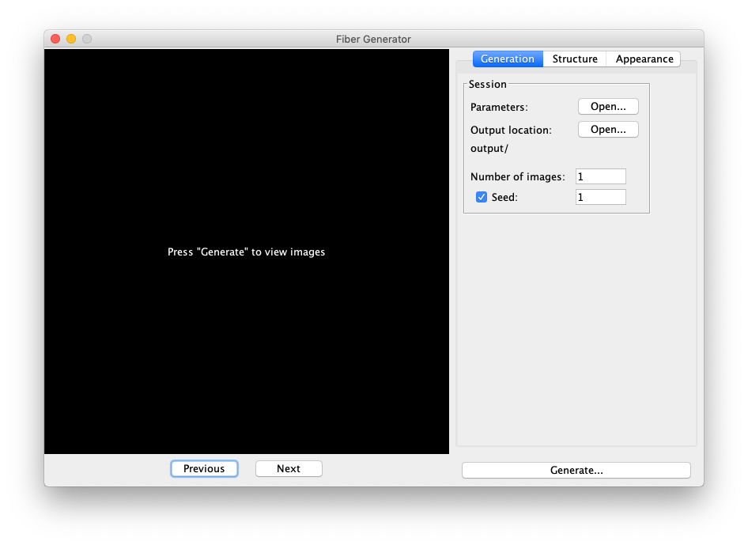
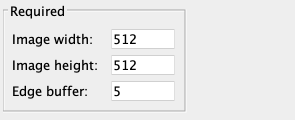
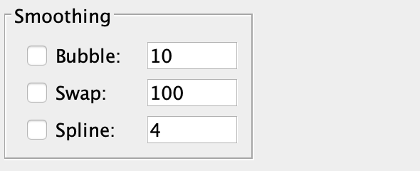

# Synthetic Fiber Generator - SynFiber

Affectionately known as "worm simulator." Written by Matthew Dutson for the [Laboratory for Optical and Computational
Instrumentation](https://loci.wisc.edu) (LOCI) at the University of Wisconsin-Madison.


## Objective

[CT-FIRE](https://loci.wisc.edu/software/ctfire) and [CurveAlign](https://loci.wisc.edu/software/curvealign) were
developed by LOCI to analyze images of collagen fibers in human tissue. The alignment and orientation of these fibers
can be a prognostic signature for certain cancers. SynFiber allows the user to generate synthetic images of collagen
fibers with specific, known properties. These images can be used to verify the accuracy and test the limitations of
CT-FIRE and CurveAlign.

More generally, SynFiber can be used to simulate images of any fibrous structure. It allows a great deal of
customization of both the structure and appearance of fibers.


## Installation

SynFiber is distributed as ZIP archive - visit the
[Releases](https://github.com/uw-loci/syntheticfibergenerator/releases) page for the most recent version. The extracted
directory contains the following:

 * `syn_fiber.jar`: The main JRE executable
 * `defaults.json`: The default parameters file - this can be modified by the user
 * `output/`: The default output location

The JAR comes bundled with all dependencies, so the only prerequisite for running is an installation of the Java Runtime
Environment (v1.8 or newer), which can be downloaded [here](http://www.java.com). SynFiber can be run simply by
double-clicking `syn_fiber.jar` or from the command-line by navigating to the extracted directory and typing `java -jar
syn_fiber.jar`


## Downloading the Source

The source is available from the Releases page or the project repository. It has two dependencies: Apache Commons Math
and Google Gson. The test suite additionally requires JUnit 5. All three are available from Maven Central.

### Apache Commons Math
```xml
<dependency>
   <groupId>com.google.code.gson</groupId>   
   <artifactId>gson</artifactId>
   <version>2.8.5</version>
</dependency>
```

### Gson
```xml
<dependency>
   <groupId>org.apache.commons</groupId>   
   <artifactId>commons-math3</artifactId>
   <version>3.6.1</version>
</dependency>
```
    
### JUnit 5
```xml
<dependency>
   <groupId>org.junit.jupiter</groupId>   
   <artifactId>junit-jupiter-api</artifactId>
   <version>5.3.1</version>
</dependency>
```


## Basic Operation

On startup, the following window will display:



Provided SynFiber was launched in a valid working directory (one which contains `defaults.json` and `output/`) an image
can be produced with default parameters by pressing the "Generate" button. A preview of the generated image will be
displayed on the left side of the window.

To generate more than one image, modify the "Number of images" field and press the "Generate" button. The user can cycle
through previews of multiple images by pressing the "Previous" and "Next" buttons.

While parameters can be manually modified through the GUI, it's often more convenient to load a batch of parameters from
a JSON file. This can be accomplished by pressing the "Open" button to the right of the "Parameters" label. Each time
"Generate" is pressed, the current parameters are saved as `params.json` in the output directory. `params.json` has the
same format as `defaults.json` and can be used to restore a previous session.

By default, image and data files are written to `output/` in the working directory. To change this location, press the
"Open" button to the right of the "Output Location" label and select the desired directory.


## Explanation of Options

### Session

 * Parameters: Used for bulk loading of parameters from a previous session (see "Basic Operation").
 * Output location: Used to set the output directory - this defaults to `output/`.
 * Number of images: The number of random images to generate.
 * Seed: Whether to fix the random seed at the start of execution. If this is unchecked, a different set of images will
   be produced each time "Generate" is pressed. If checked, the sequence of random images will depend on the seed value.


### Distributions

 * Length distribution: A fiber's length is defined as the sum of the lengths of its segments in pixels. Each fiber's
   length is chosen by randomly sampling from the user-provided distribution.
 * Width distribution: The width in pixels of each fiber's first segment is randomly sampled from this distribution. The
   evolution of the width after the first segment is governed by the "Width change" parameter.
 * Straightness distribution: Fiber straightness is defined as the ratio of the distance between a fiber's endpoints to
   its length. Values must be in the range 0-1. After a fiber's length is sampled, a straightness is sampled from this
   distribution and used to determine the distance between its endpoints.


### Values

 * Number of fibers: The number of fibers in each image.
 * Segment length: Each fiber is composed of linear segments. This parameter gives the length of each segment in pixels.
 * Width change: The maximum amount (in pixels) by which a fiber's width can change between two adjacent segments. The
   actual change is sampled from a uniform distribution between `-widthChange` and `+widthChange`. If the current
   segment's width is less than `widthChange`, then the sampling is instead from `-segment.width` to `+segment.width`.
 * Alignment: Let there be $n$ fibers in an image with each having angle $\theta_i$. The alignment of the image is given
   by:
   $$
   \text{mag}\left(
     \sum_{i = 0}^n e^{2i \cdot \theta_i}
   \right)
   $$
 * Mean angle: Again let there be $n$ fibers with angles $\theta_i$. The mean angle of the image is given by:
   $$
   \text{arg}\left(
     \sum_{i = 0}^n e^{2i \cdot \theta_i}
   \right)
   $$
   For two or more fibers it's always possible to choose a set of fiber directions satisfying a given alignment and mean
   angle.


### Required

 * Image width: The width of the output images in pixels.
 * Image height: The height of the output images in pixels.
 * Edge buffer: The number of empty pixels to leave around the edge of the image. If a fiber doesn't fit in the padded
   region then the buffer is set to zero for that fiber. The edge buffer only restricts the positions of endpoints.
   Fibers with low straightness may "wander" outside the padded region and end up near the edge of the image.



### Optional

 * Scale: Check to show a scale bar in the lower-left corner of the image. The parameter value gives the number of
   pixels per micron.
 * Down sample: Check to scale the image by the specified factor. A bilinear interpolation is used. Note that this
   option can be used to scale the image both down and up.
 * Blur: Check to apply a Gaussian blur to the image. The parameter value gives the height and width of the blurring
   kernel in pixels.
 * Noise: Check to add Poisson noise. The parameter value gives the Poisson mean. Each pixel has a brightness from 0 to
   255. The value sampled from the Poisson distribution is added to this (capping the pixel brightness at 255).
   Therefore noise rates in the range 0-255 are typical.
 * Distance: Check to apply a distance filter. Let `falloff` be the parameter value. The intensity (0-255) of each pixel
   in the output image is equal to `falloff` times the distance to the nearest black background pixel.


### Smoothing

 * Bubble: Runs a smoothing algorithm which sweeps over the fiber and swaps adjacent segments if doing so makes the
   fiber appear smoother. The parameter value gives the number of passes to make.
 * Swap: Runs a smoothing algorithm which swaps random pairs of segments if doing so makes the fiber appear smoother.
   The parameter value gives the average number of swaps attempted per segment.
 * Spline: Uses polynomial splines to interpolate extra points. The parameter value is roughly the ratio of the number
   of points after smoothing to the number of points before smoothing.


